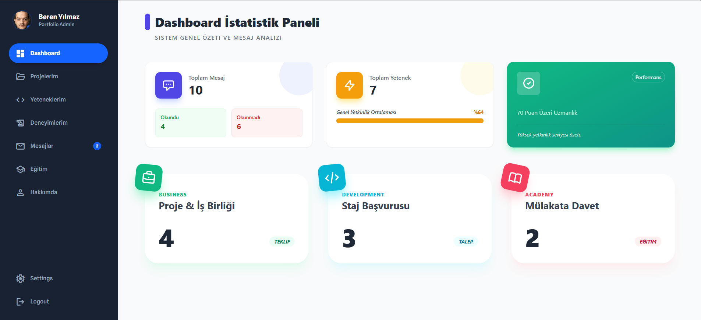

# 🚀 Dynamic Portfolio & Admin Panel

 
<div align="center">

  
  
  
  
  

</div>

## 📖 Proje Hakkında (About the Project)

Bu proje, **AkademiQ.Ai** eğitim süreci kapsamında geliştirilmiş, uçtan uca (End-to-End) bir portfolyo web uygulamasıdır. 

Projenin temel amacı, sadece çalışan bir uygulama geliştirmek değil; var olan statik bir yapıyı **Refactoring** (Yeniden Düzenleme) süreciyle modernize etmektir. Hazır bir HTML şablonu **jQuery ve Bootstrap** bağımlılıklarından arındırılmış, bunun yerine **Tailwind CSS** ve **Modern JavaScript** kullanılarak performans odaklı bir mimari kurulmuştur.

### 🎯 Temel Hedefler
* **Modernizasyon:** Legacy (eski) kütüphaneler yerine modern CSS/JS kullanımı.
* **Dinamik Yönetim:** İçeriklerin tamamının Admin paneli üzerinden yönetilebilir olması.
* **Clean Architecture:** Modüler ve sürdürülebilir kod yapısı.

---

## 📸 Ekran Görüntüleri (Screenshots)

<h3>Admin Paneli (Dashboard)</h3>


<h3>Kullanıcı Arayüzü (UI)</h3>

---

## 🛠️ Teknolojiler (Tech Stack)

| Alan | Teknolojiler |
| --- | --- |
| **Backend** | .NET 8.0, ASP.NET Core MVC |
| **Database** | MSSQL, Entity Framework Core (DB First Approach) |
| **Frontend** | Tailwind CSS, Vanilla JavaScript (ES6+), HTML5 |
| **Tools** | Visual Studio 2022, Git, SSMS |

---

## ✨ Özellikler (Features)

* **Dinamik Admin Paneli:** Projeler, yetenekler ve deneyimler veritabanı üzerinden yönetilebilir.
* **Active State Yönetimi:** ViewContext yapısı ile Sidebar'da bulunulan sayfanın otomatik vurgulanması.
* **ViewComponent Mimarisi:** Tekrar eden HTML bloklarının modüler hale getirilmesi.
* **Responsive Tasarım:** Tailwind CSS ile tüm cihazlara uyumlu arayüz.
* **Asenkron İşlemler:** AJAX tabanlı form gönderimi ve veri listeleme (Opsiyonel eklendi ise).
* **Güvenlik:** Admin paneli için yetkilendirme altyapısı.

---

## ⚙️ Kurulum (Installation)

Projeyi yerel makinenizde çalıştırmak için aşağıdaki adımları izleyin:

1.  **Projeyi Klonlayın**
    ```bash
    git clone [https://github.com/KULLANICI_ADINIZ/REPO_ADINIZ.git](https://github.com/KULLANICI_ADINIZ/REPO_ADINIZ.git)
    ```

2.  **Veritabanı Bağlantısı**
    `appsettings.json` dosyasındaki Connection String'i kendi yerel SQL Server bilgilerinize göre güncelleyin.

3.  **Veritabanını Oluşturun**
    Package Manager Console üzerinden update komutunu çalıştırın:
    ```bash
    Update-Database
    ```
    *(Not: DB First yaklaşımı kullanıldığı için SQL script dosyası gerekiyorsa buraya not düşebilirsiniz)*

4.  **Projeyi Çalıştırın**
    ```bash
    dotnet run
    ```

---

## 👏 Teşekkürler (Acknowledgements)

Bu projenin geliştirilmesindeki teknik rehberlikleri için **Murat Yücedağ** ve **Erhan Gündüz** hocalarıma; vizyonu için **Gökhan Mutlay**'a teşekkür ederim.

---

## 📞 İletişim

* **Geliştirici:** [Adınız Soyadınız]
* **LinkedIn:** [Linkedin Profil Linkiniz]
* **Email:** [E-posta adresiniz]